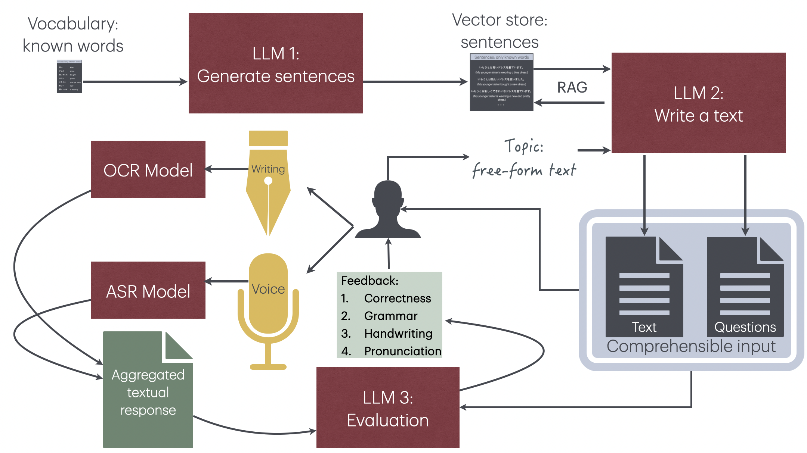
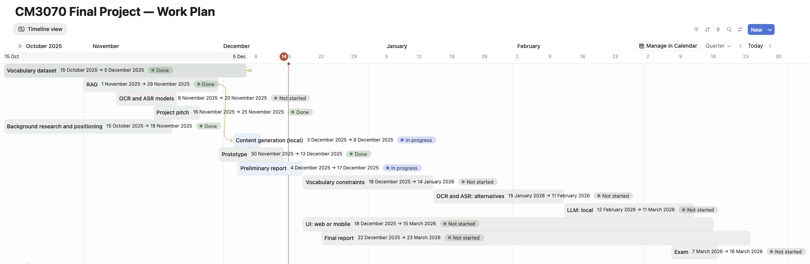

## 3. Design and implementation

### 3.1 Project overview

The **AI-Powered Japanese Language Exercise System with Multimodal Feedback** is based on *Template: CM3020 Artificial Intelligence. Project Idea 1: Orchestrating AI models to achieve a goal*. It is an intelligent tutoring system designed to support Japanese language learners in consolidating and improving their skills in four key competencies: written accuracy, pronunciation, handwriting, and comprehension. Rather than introducing new vocabulary or grammatical structures, the system functions as a retention and fluency training aid that operates on learner-curated vocabulary obtained from other resources.

The system employs orchestration of pre-trained models including Large Language Models (LLMs), Automatic Speech Recognition (ASR), Optical Character Recognition (OCR), and semantic vector embeddings to provide comprehensive, multimodal feedback across handwritten responses, spoken answers, and written assessments. With the help of Retrieval-Augmented Generation (RAG), the system generates contextually coherent exercises utilising the learner's established vocabulary inventory.

### 3.2. Domain and users

The system focuses on the acquisition of Japanese as a foreign Language. Its pedagogical aim is to enhance retention and communicative proficiency rather than facilitate initial vocabulary acquisition. The project's instructional goals prioritise fluency through repeated practice, accuracy via multimodal feedback, and explicit handwriting skill development that complements typing-based practice.

Primary users are beginner-to-intermediate Japanese learners who already possess foundational knowledge and need structured practice to consolidate material. The system also targets self-directed adult learners and students using classroom materials who want supplementary practice outside formal instruction. Secondary users include language teachers who will use the system for formative assessment and curriculum designers or institutions seeking to augment courseware with aligned practice tools.

Learners require immediate, actionable feedback across spoken, typed, and handwritten responses, and exercises must remain within their curated vocabulary to avoid introducing unfamiliar items prematurely. They also benefit from varied, engaging exercise contexts. Practical constraints include sensitivity to feedback latency, high variability in handwriting quality, differing levels of technical literacy among adult users, and potentially limited internet bandwidth in some deployment contexts.

### 3.3. System architecture

The system workflow consists of several interconnected components. First, a large language model (LLM) generates sentences from a pre-defined vocabulary list representing the learner's current knowledge base. These sentences are embedded in a vector database to enable semantic retrieval. This operation is performed once for a target vocabulary.

When a learner specifies a topic of interest, the system employs Retrieval-Augmented Generation (RAG) to construct coherent texts using only familiar linguistic elements. Simultaneously, comprehension questions are generated to assess understanding.

The system's defining characteristic emerges in its multimodal assessment approach. Learners respond to questions both in handwritten form and through spoken input. The OCR model converts handwritten responses to text, while the ASR model processes spoken answers. The dual-modality requirement creates a unique validation mechanism: ideally, both responses should be identical, providing an internal consistency check. Both responses are then evaluated by an LLM for semantic correctness and relevance to the question.

The feedback is comprehensive, addressing four dimensions:

- **semantic correctness** (Does the answer address the question appropriately?),
- **grammatical accuracy** (Is the Japanese grammatically sound?), 
- **handwriting quality** (Are there character recognition errors indicating poor stroke order or form?), 
- **pronunciation accuracy** (Does the spoken output match phonemic expectations?).

The system's architecture is illustrated below:

### 3.4. Design justification

#### 3.4.1 Pedagogical

The design emphasises comprehensible input: exercises are constrained to the learner's existing vocabulary so that all content remains understandable. Multimodal speech production and explicit handwriting practice are included to improve pronunciation, form-meaning connections, and motor-visual skills that typing or speaking alone cannot address.

#### 3.4.2 Technical

RAG over a vector database is an efficient way to limit the context passed to the text-generating LLM, to ground the outputs in the learner's vocabulary, preventing vocabulary leakage.

The solution orchestrates specialised models (LLM, ASR, OCR, embeddings) so each modality is handled by the best-suited model. Even though modern state-of-the-art LLMs are capable of both speech recognition and handwriting OCR, they cannot be hosted on consumer-grade hardware. Moreover, the cost of using a commercial solution for any other inputs than text may be prohibitive for many users. 

The system adds multimodal consistency checks to separate input-processing errors from linguistic errors and employs LLMs as rubric-based judges for structured, consistent evaluation.

#### 3.4.3 Practical

Requiring a learner-specified vocabulary list ensures curriculum alignment and makes the system a supplement to instruction rather than a replacement. Feedback is layered, which makes diagnostics actionable, and dual input increases the learner's engagement.

### 3.5. Work plan

The image below shows a timeline of the project's development:

#### 3.5.1. Completed stages

After selecting the template, the work started with compiling the **vocabulary dataset**. Because of copyright restrictions linked with most existing Japanese language materials available commercially, it was decided to use generated sentences to populate the vector store for further retrieval. After many unsuccessful attempts to generate sentences from a pre-defined list of words and phrases using a local model, the project switched to using a remote model. As a result, an algorithm was created to repeatedly invoke the Perplexity Sonar model via an API with a subsection of the vocabulary for each entry. The resulting dataset consists of 7833 unique Japanese sentences, making sure that each entry in the vocabulary list is represented at least once.

The **RAG** pipeline was created simultaneously with the dataset preparation, and its word-retrieval component was used during the sentence generation stage.

A number of **OCR and ASR models** were tested and selected for use in the prototype. *Manga OCR* was selected for its ability to process multiline text, whereas alternatives such as *PaddleOCR* were considered but rejected due to their poor performance on images of non-standard sizes. *wav2vec2* was selected as an ASR model for its high accuracy and convenience of deployment.

Simultaneously, the **Background research and positioning** were carried out to identify potential use cases and existing solutions, as a preparation for the **Project pitch** delivery.

After the **RAG** stage was completed, the work started on combining the elements of the project, previously developed separately, into a single **Prototype** application. This required the utilisation of the *uv* library for managing Python environments, since different components of the application required different versions of Python and its libraries, such as `numpy`.

The **Content generation (local)** assumed generating text and comprehension question using a local LLM model, but the experiments with small models with 270M-4B parameters showed that the quality of the generated text was not satisfactory. Therefore, the work proceeded with the Perplexity Sonar model via API.

The present **Preliminary report** describes the project and concludes the first phase of the project's development.

#### 3.5.2. Planned stages

Further work will involve ensuring **Vocabulary constraints** either via prompt engineering, template-based approach, or result filtering via a feedback loop. **Alternatives to OCR and ASR** models will be evaluated to verify if increased accuracy is possible with a different model. Another attempt to use a **local LLM** for text generation will be made, with the fallback option of using the remote model, like in the presented prototype, if the quality or the performance of local models are not satisfactory.

In parallel with the aforementioned improvements, work on the **Web or mobile UI** will be carried out, as the changes in the application's components will not require alterations in the user workflow or the data flow in the system. The evaluation and testing will be performed iteratively at every stage, ensuring there is no regression in the system's functionality.

The **Final report** will be prepared in parallel with the development of the application.

### 3.6. Evaluation plan

This testing and evaluation plan defines measurable objectives, the methods to verify them, anticipated failure modes with mitigations, and the criteria that constitute project success.

#### 3.6.1. Evaluation goals and failure modes

The evaluation goals focus on measurable performance across modalities, exercise and feedback quality, learning outcomes, usability, and reliability, specifically:

- modal processing accuracy aims for average ASR and OCR confidence consistent with reliable conversion (ASR and OCR correctly convert learner inputs with >85% confidence on average);
- exercise generation should maintain semantic coherence and strict vocabulary compliance;
- feedback should correctly identify errors at a high rate;
- learners should show measurable improvements in retention after sustained use;
- usability targets include high task completion and user satisfaction;
- system uptime and latency targets must meet operational expectations.

Failure modes must be identified for each critical component and paired with mitigations. For example, persistent ASR errors due to accent can be mitigated by switching or retraining ASR models and providing manual input fallbacks. OCR failures from handwriting variability can be addressed with preprocessing, targeted training, and manual correction options using a feedback loop. LLM generation or evaluation failures that violate vocabulary constraints must be mitigated by strict post-generation filtering and human curation for edge cases.

#### 3.6.2. Efficiency of vocabulary embedding and retrieval

The efficiency of the vocabulary retrieval must be tested using a variety of approaches:
- embedding words and phrases with and without transcriptions;
- retrieving words and phrases by the lexeme versus the translation;
- evaluating RAG performance with the retrieval of raw vocabulary rather than sentences.

In all these cases, the retrieval efficiency must be measured against the expected performance of the system.

#### 3.6.3. Performance evaluation

Latency is a critical metric for maintaining the user's engagement. The system must be evaluated to determine the optimal latency targets for each component. Currently, the OCR and ASR are performed consecutively and together show the combined latency over 60 seconds, which is too high for real-time feedback. Afterwards, the usage of a remote LLM service introduces additional latency.

The performance evaluation and improvement plan includes
- caching of content generation results;
- asynchronous pipelines to reduce the waiting time until the first feedback;
- alternative OCR and ASR models for real-time feedback.

Project completion criteria include comprehensive documentation, reproducible deployment, and strong code quality and test coverage.
