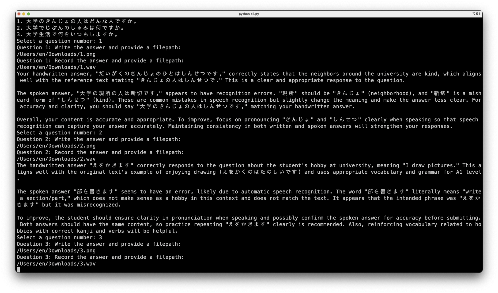

## 4. Prototype description and evaluation

### 4.1. Technical implementation and feasibility demonstration

The prototype demonstrates the technical feasibility of the proposed system through the integration of several key components: **retrieval-augmented generation (RAG)** for vocabulary-constrained content synthesis, **multimodal input processing** combining Optical Character Recognition (OCR) and Automatic Speech Recognition (ASR), and **LLM-based assessment** for evaluating linguistic correctness across written and spoken modalities.

#### 4.1.1 Vocabulary-controlled content generation via RAG

The system employs a vector store populated with A1-level Japanese sentences containing target vocabulary entries and syntactic patterns. When a learner specifies a topic, semantically related vocabulary is retrieved from this repository, and a prompt is constructed that instructs the LLM to generate text and comprehension questions using only the retrieved items. This approach addresses a critical pedagogical requirement: ensuring that exercise content remains within the learner's proficiency boundaries, thereby minimising the cognitive load. Moreover, this reduces the likelihood of introducing new lexical items without explicit pedagogical intent.

The prototype invokes Perplexity's Sonar model via API.

#### 4.1.2 Multimodal answer capture and conversion

The prototype successfully captures learner responses in two modalities:

- **Handwritten responses** are photographed and processed through OCR using the MangaOCR model to extract text.
- **Spoken responses** are recorded as audio files and processed through ASR using a fine-tuned variant of Facebook's XLSR-Wav2Vec2 model to produce transcriptions.

This dual-modality approach reflects the reality of language learning assessment, where both written and oral production are important measures of proficiency. The separation of these modalities in feedback generation allows the system to identify whether errors stem from orthographic or phonetic issues or deeper grammatical misunderstandings.

#### 4.1.3 LLM-based comparative assessment

The two transcriptions are compared, and the assessment model verifies that they have identical content, to then provide detailed feedback along four dimensions: semantic, grammatical, orthographic, and phonetic.

The image below shows the state of the application after the submission of responses for two questions. It demonstrates both the user input in the form of file paths to the handwritten answer image and audio recording, and the response from the LLM evaluator containing multi-modal feedback.

This multidimensional feedback mechanism corresponds to the principles of formative assessment in language learning, where immediate, specific feedback on multiple linguistic dimensions supports skill development [Black & William, 1998; Nicol & Macfarlane, 2006].

### 4.2. Evaluation of prototype performance and identified limitations

#### 4.2.1 Breaking vocabulary constraints

The generated text and accompanying questions are not consistently restricted to the vocabulary entries fetched from the vector store. Analysis of the prototype's outputs reveals instances where words appear that are not explicitly present in the learner's vocabulary list, particularly in the form of kanji or morphological variants.

The current implementation relies on semantic retrieval from the vector store to construct the prompt but does not enforce hard constraints on the LLM's output vocabulary. The model may generate plausible alternatives or morphological variations, such as verb conjugations or particles, that were not explicitly retrieved, treating these as semantically equivalent to the restricted vocabulary.

Plain validation via vocabulary look-up is challenging in the Japanese language, because Japanese text lacks whitespace delimiters, making detecting unknown words written in hiragana substantially more difficult. Unlike English or even kanji-heavy text, pure hiragana sequences provide no intrinsic morphological boundaries.

Instead, after generation the output can be processed with a comprehensive kanji dictionary, such as the KANJIDIC2 database used in NLP systems, to identify any kanji that are not in the learner's approved list. These characters can be flagged and the generation request rejected, requiring the LLM to regenerate the content using only approved kanji. Alternatively, a template-based lexically constrained text generation approach [Iso et al., 2022] can be used.

Another potential solution is to leverage Japanese morphological analysers such as MeCab (with an appropriate dictionary like NEologd) or JUMAN++ which can segment the hiragana text and identify word boundaries. The identified words can then be checked against the approved vocabulary list. However, these tools have known limitations: they may struggle with rare words or non-standard usage common in learner-produced or AI-generated text.

#### 4.2.2 Dependency on external LLM services

The prototype relies on the Perplexity Sonar model accessed via API. This introduces latency, dependency on external service availability, and ongoing API costs, limiting the system's applicability in offline or resource-constrained educational settings.

Recent developments in open-source, small-scale LLMs optimised for Japanese [SiliconFlow, 2025] make local deployment increasingly viable. However, our initial findings indicate that while smaller models can produce grammatically acceptable Japanese, they often:

- struggle with fine-grained vocabulary control when prompted with a vocabulary list that exceeds their context window,
- occasionally introduce hallucinations or semantically incoherent content,
- produce less nuanced feedback in comparative assessment tasks,
- show the reduced ability to maintain consistency across multi-turn interactions.

However, incremental improvements may be achievable through:
- fine-tuning on a corpus of vocabulary-restricted Japanese language exercises to improve adherence to vocabulary constraints,
- prompt engineering and inclusion of few-shot examples in the prompt,
- ensemble or cascading approaches, using a smaller local model for initial text generation, with verification and refinement via a larger external model only when quality thresholds are not met.

The field of efficient Japanese LLMs is rapidly evolving. Continued monitoring of model releases and performance benchmarks is essential to identify the optimal trade-off point between model size, quality, and latency for this educational application.

#### 4.2.3 OCR and ASR precision

While the prototype successfully demonstrates multimodal input processing, both OCR and ASR introduce errors that can cascade through the system. Similar-looking characters may be misidentified, leading to incorrect transcriptions of learner responses. Additionally, ASR systems are prone to homophony and context-dependency, leading to incorrect transcriptions of speech.

To assess the system performance, comparative evaluation of open-source OCR (Tesseract with Japanese language packs, PaddleOCR, EasyOCR) and ASR systems (Whisper, Faster-Whisper, Noto Speech Recognition) must be conducted against the current implementations.

Domain-specific adaptation via fine-tuning on a corpus of A1-level learner handwriting and speech can reduce the impact of these errors. However, this approach requires a large corpus of labelled handwritten and spoken data produced by beginner-level learners, which may not be available.

Instead, confidence-based filtering can be used to detect and reject incorrect transcriptions, where the system can request user confirmation or re-recording when the confidence of the generated output falls below a threshold.

#### 4.2.4 User interface and workflow

The prototype uses a command-line interface (CLI) that requires that the learners:
1. Manually photograph handwritten answers (producing PNG files)
2. Separately record audio responses (producing WAV files)
3. Save both files locally
4. Manually input file paths into the CLI
5. Ensure audio is encoded in the correct format (16-bit, 16 kHz WAV)

This workflow introduces friction and is not representative of how learners would naturally interact with the system in an educational setting.

The following improvements can be made to enhance usability:

1. A web-based or native mobile application could provide:
   - *real-time handwriting capture* using a tablet or touchscreen (with fallback to photograph upload),
   - *one-tap or -click audio recording* with automatic format conversion,
   - *preview and confirmation* before submission, reducing errors and requests for re-recording.

2. Automatic management of file encoding, format conversion, and clean-up can eliminate the need for user involvement in technical details.

3. Initially presented with a simple "Record" button, advanced learners or educators could access settings for fine-tuning quality parameters, such as noise suppression.

### 4.3. Summary

The prototype successfully demonstrates the feasibility of an integrated system for vocabulary-constrained exercise generation and multimodal assessment. However, several opportunities for improvement are evident:

1. Implementing a feedback loop with the detection of lexical units not present in the vocabulary can reduce constraint leakage while maintaining generation fluency.

2. Continued monitoring of small-scale, Japanese-specialised LLMs, combined with prompt engineering techniques, offers a path toward offline deployment without significant quality compromise.

3. Confidence-based filtering can improve transcription accuracy while reducing false positives in error detection.

4. A GUI that handles capture, format conversion, and file management will significantly improve usability for real-world deployment.

These improvements may contribute to positioning the system as a technically sound and pedagogically grounded contribution to the field.
